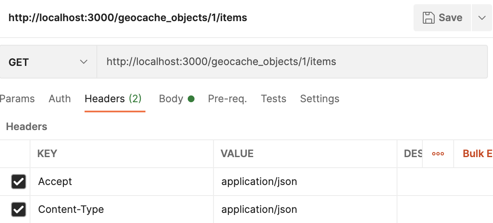
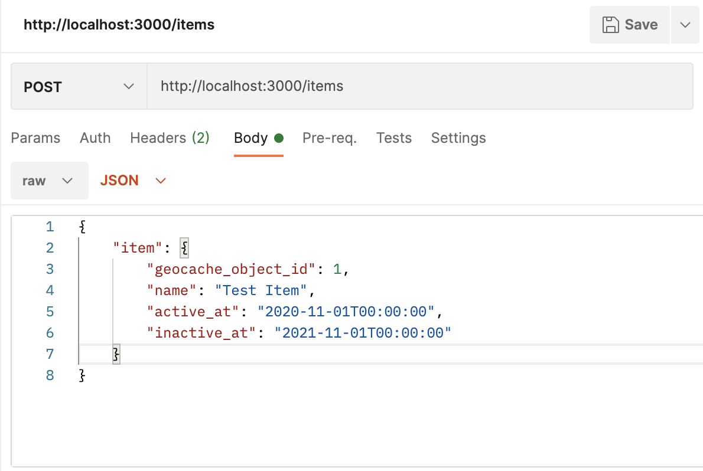
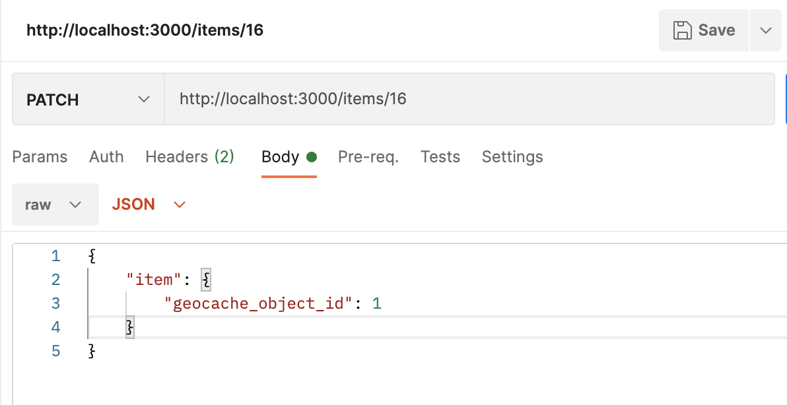

# Geocache API Exercise

## How to Run Locally
- Step 1: git clone git@github.com:kcarrel/geo-exercise.git
- Step 2: cd into the local repository copy
- Step 3: bundle install
- Step 4: Run 'rake app:create_sample_data' to seed the database with sample Geocache Object and Items to test against or inspect.
- Step 4: rails s to start server
## Routes 
Examples shown below are utilizing Postman and all use the following:
    headers:
        Content-Type: application/json,
        Acccept: application/json

* **GET /geocache_objects/${GeocacheObjectId}/items** - get all active items from a given geocache object

* **POST /items** - add a new item

* **PATCH /items/${ItemId}** - update an item's associated geocache object

## How to Run Tests
- Step 1: While in the local repository run 'rspec ./spec/models/item_spec.rb' in your terminal to initiate the model tests for Item.
- Step 2: While in the local repository run 'rspec ./spec/requests/items_request_spec.rb' in your terminal to initiate the Item controller tests.
- Step 3: While in the local repository run 'rspec ./spec/requests/geocache_objects_request_spec.rb' in your terminal to initiate the Geocache Object controller tests.
## Technology Used
- Ruby on Rails 
- RSpec
- PostGIS
